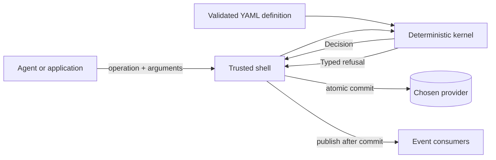

# Entity Runtime

> Let agents propose. Let deterministic rules decide.

Entity Runtime turns a domain model into a safe execution boundary. You declare an entity's
schema, lifecycle, operations, rules, and events in YAML. An application or AI agent may request a
named operation; a deterministic Rust kernel either returns the complete next decision or a typed
refusal.

```text
definition + instance + operation + arguments -> Decision { instance, record, events }
```

The kernel performs no IO, reads no clock, invents no identity, and mutates no caller-owned state.
Storage, authentication, timestamps, transport, and event publication remain explicit concerns of
the application around it.

[Read the product guide](https://beyond10x.github.io/entity-runtime/) or
[download a release](https://github.com/beyond10x/entity-runtime/releases).

## Why use it?

Agent prompts are useful for intent and judgment, but they are a poor place to hide business
invariants. A prompt can be revised, truncated, bypassed, or interpreted differently by another
model. Entity Runtime puts the rules that must always hold into versioned data evaluated by trusted
code.

That gives a system one boundary for:

- closed schemas and lifecycle transitions;
- named preconditions and invariants with actionable refusals;
- optimistic concurrency and atomic state-plus-history writes;
- normalized decision records that can be replayed and verified;
- domain events derived only after a decision succeeds;
- human diagrams, API contracts, MCP tools, and dedicated CLIs generated from the same model.

It is a toolkit, not a hosted service. Use the kernel as a Rust library, the `entity` command as a
reference shell, or the provider and generated-surface crates in your own application.

## The boundary



The model may choose `refund.approve` and propose a reason. The trusted shell decides which
definition and store are mounted, derives recording provenance from its authenticated context,
supplies the observed revision, and decides whether events are published. The kernel alone decides
whether the requested transition is legal.

## A definition is data

This complete definition declares one field, three states, and two legal operations:

```yaml
entity: ticket
version: 1

schema:
  additional_fields: false
  fields:
    title: { type: string, required: true, min_length: 1 }

lifecycle:
  initial: open
  states: [open, active, closed]

operations:
  start:
    transitions: [{ from: open, to: active }]
  close:
    transitions: [{ from: active, to: closed }]
```

Real definitions can add typed arguments, defaults, nested objects, references to other entity
types, preconditions, invariants, field assignments, projections, and event templates. See the
[definition language](https://beyond10x.github.io/entity-runtime/docs/guide/definitions) and the
shipped [`refund`](examples/refund.yaml) and [`order`](examples/order.yaml) examples.

## Try it

Prebuilt `entity` binaries for Linux, macOS, and Windows are attached to every release with a
`SHA256SUMS` file. From a checkout, install the same command with:

```console
cargo install --path crates/entity-cli --locked
```

Then validate and inspect the refund model:

```console
$ entity validate examples/refund.yaml
examples/refund.yaml: valid (refund v1)
1 file(s), 0 invalid

$ entity graph examples/refund.yaml
refund v1: initial draft
draft --submit--> submitted
submitted --approve--> approved
submitted --reject--> rejected
```

Create and advance an instance without persistence:

```console
entity create \
  --definition examples/refund.yaml \
  --id ref-123 \
  --fields '{"order_id":"ord-9","amount_cents":2500,"evidence_count":1}' \
  > draft.json

entity execute \
  --definition examples/refund.yaml \
  --instance @draft.json \
  --operation submit \
  > submitted.json

$ entity execute \
    --definition examples/refund.yaml \
    --instance @submitted.json \
    --operation approve \
    --arguments '{"actor_role":"agent","reason":"receipt verified"}' \
    --format text
refund ref-123 is approved (revision 3); events: RefundApproved
```

A `Decision` printed by `create` or `execute` can be passed back as the next `--instance`. Add
`--store` and recording metadata when the command should persist the decision; the
[storage guide](https://beyond10x.github.io/entity-runtime/docs/guide/storage) explains the write
contract and provider choices.

Exit code `0` means the command decided successfully, `1` means a definition, kernel operation, or
store write was refused, and `2` means the invocation was invalid. Kernel and store refusals are
structured data; no refusal is a partial success.

## Use the same model everywhere

The `entity` command projects a validated definition set into several surfaces:

```console
# Mermaid, Graphviz DOT, SVG, HTML, or terminal text
entity graph --format mermaid examples/refund.yaml

# Browsable entity pages plus OpenAPI and AsyncAPI in JSON and YAML
entity generate docs --definition examples/refund.yaml --out ./refund-reference

# Schema-derived tools such as refund.create, refund.get, and refund.approve
entity mcp --definition examples/refund.yaml --store ./refund-store

# A retained, Clap-derived Rust command with refund create/get/list/events/operations
entity generate rust-cli \
  --definition examples/refund.yaml \
  --name refundctl \
  --out ./bin/refundctl

# A compact, version-stamped Agent Skills document for the installed command
entity skill
```

Generated OpenAPI describes an HTTP facade an adopter may implement; it does not start a hidden
server. Generated AsyncAPI describes emitted domain events; it does not select a broker. The MCP
server uses stdio and a caller-selected File Store. These boundaries keep generated convenience
from silently choosing infrastructure or authority.

The command surface is:

| command | purpose |
|---|---|
| `validate` | parse and register one or more definitions, reporting every invalid file |
| `inspect` | show what a definition declares: fields, states, rules, and operations |
| `graph` | render lifecycle or typed-reference graphs as text, Mermaid, DOT, SVG, or HTML |
| `create` / `execute` | request a decision, optionally committing it to a File Store |
| `list` | list stored identities for one entity type |
| `generate docs` | write entity pages plus OpenAPI and AsyncAPI contracts |
| `generate rust-cli` | build a definition-specific Rust command |
| `mcp` | expose stored entities as schema-derived MCP tools over stdio |
| `store migrate-file` | validate and perform an out-of-place File Store v1-to-v2 migration |
| `skill` | render the Agent Skills guide for this installed CLI version |

Run `entity <command> --help` for the exact arguments and safety conditions.

## From Rust

```rust
use entity_core::{Registry, Runtime};
use serde_json::json;

let definition = entity_yaml::from_str(include_str!("../examples/order.yaml"))?;
let mut registry = Registry::new();
registry.register(definition)?;
let runtime = Runtime::new(&registry);

let created = runtime.create(
    "order",
    1,
    "ord-1",
    json!({"customer_id": "c-1", "total_cents": 2599}),
)?;
let submitted = runtime.execute(
    &created.instance,
    "submit",
    json!({"actor": "alice"}),
)?;
let approved = runtime.execute(
    &submitted.instance,
    "approve",
    json!({"actor": "alice"}),
)?;

assert_eq!(approved.instance.lifecycle_state, "approved");
assert_eq!(approved.instance.revision, 3);
```

Registration is the validation boundary: execution receives a `ValidatedDefinition`, never an
unchecked parsed document. On refusal, the caller still owns the unchanged prior instance.

## Architecture

| crate | responsibility |
|---|---|
| [`entity-core`](crates/entity-core/) | IO-free definitions, validation, decisions, typed refusals, and verified replay |
| [`entity-yaml`](crates/entity-yaml/) | YAML text to definition data, without filesystem IO |
| [`entity-store`](crates/entity-store/) | provider traits, memory/File Store, envelopes, projections, and conformance suites |
| [`entity-sqlite`](crates/entity-sqlite/) | embedded transactional persistence |
| [`entity-postgres`](crates/entity-postgres/) | centralized transactional persistence |
| [`entity-remote`](crates/entity-remote/) | transport-neutral remote protocol and explicit hybrid policy |
| [`entity-graph`](crates/entity-graph/) | deterministic lifecycle and reference graphs |
| [`entity-surface`](crates/entity-surface/) | deterministic documentation, OpenAPI, and AsyncAPI projections |
| [`entity-shell`](crates/entity-shell/) | provider-backed operations shared by command surfaces |
| [`entity-mcp`](crates/entity-mcp/) | synchronous MCP tools over caller-provided IO |
| [`entity-cli`](crates/entity-cli/) | the `entity` executable and its filesystem/process boundary |

`entity-core` depends only on `serde` and `serde_json`. Provider interfaces and every IO concern
live outside it. `MemoryStore`, `SqliteStore`, and `PostgresStore` support all-or-nothing ordered
batches; File Store atomicity is limited to one subject document.

## Guarantees and limits

- Identical inputs produce identical decisions and serialized bytes.
- Definitions reject unknown keys, invalid reference paths, and expressions outside their scope.
- Value validation accumulates defects with paths instead of stopping at the first.
- Preconditions run before assignments; invariants run against the proposed next state; events are
  materialized last.
- Complete decision replay re-executes normalized commands and compares the recorded result and
  events. Legacy event folding is an explicit, weaker migration boundary.
- `actor` and timestamps are recorded provenance, not authentication or trusted time. The host must
  supply and validate them.
- `Unreachable` is distinct from `Absent`; a network failure is never treated as proof that data
  does not exist.

The full public statement is in
[Guarantees and limits](https://beyond10x.github.io/entity-runtime/docs/guarantees).

## Develop

Requires Rust 1.85+ and [go-task](https://taskfile.dev). The local gate also needs the `protocol`
CLI for planning-store validation; PostgreSQL tests run when `ENTITY_POSTGRES_URL` is set and print
that they were skipped otherwise.

```console
task check
```

Run the command itself with `cargo run -p entity-cli --locked -- ...`. Website changes have their
own build:

```console
task site-build
```

Contributors and coding agents must read [`AGENTS.md`](AGENTS.md) before changing the repository.
The requirements register and normative designs live under [`docs/`](docs/); the standalone human
product handbook lives under [`website/docs/`](website/docs/).

## Ecosystem

- [AEP](https://github.com/beyond10x/aep) is the first adopter.
  Its artifact backends consume this repository's kernel and provider crates from one pinned
  release; the dependency points from it to Entity Runtime.
- [eventlog](https://github.com/beyond10x/eventlog) is the append-only counterpart: Entity Runtime
  decides; an event log keeps recorded facts as the durable state.
- [atlas](https://github.com/beyond10x/atlas) maps the broader beyond10x system.

## License

Apache-2.0. See [LICENSE](LICENSE).

<!-- b10x-docs:start -->
## Documentation

[Entity Runtime documentation](https://beyond10x.github.io/docs/entity-runtime/) · [Start](https://beyond10x.github.io/) · [Ecosystem](https://beyond10x.github.io/ecosystem/) · [Impact](https://beyond10x.github.io/changes/) · [Releases](https://beyond10x.github.io/releases/)
<!-- b10x-docs:end -->
