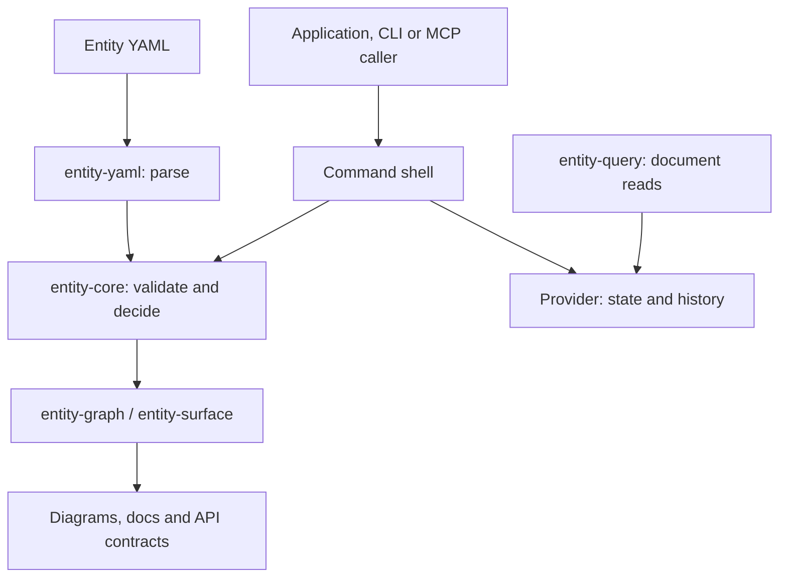
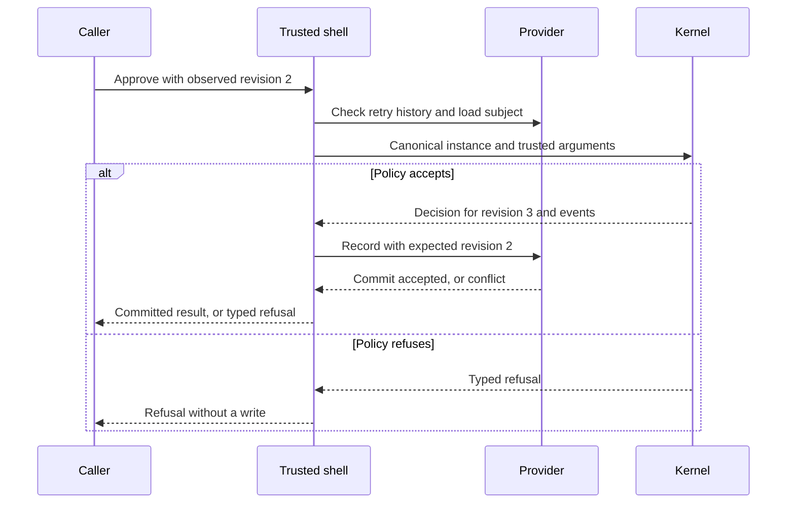
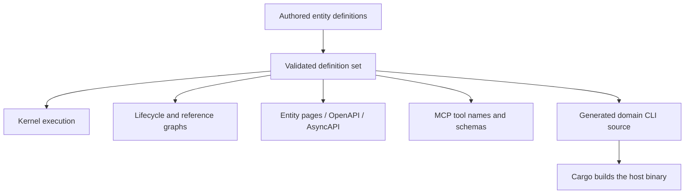

# System model

Entity Runtime is a workspace of Rust libraries and one command around a deterministic kernel. It
executes an adopter's entity definitions and derives interfaces from them. The
[crate list](../reference/crates.md) names every package; this page shows how they fit.

An entity's `version: 1` is its *definition* version. It is independent of the runtime release
(0.27.0) and of any storage format.

## Subsystems and boundaries

Arrows show inputs and calls. Storage IO stays in the selected provider; authentication, trusted
time and external effects belong to the application.

| Subsystem | Types | What it owns |
|---|---|---|
| Definition input | `EntityDefinition`, `Registry`, `ValidatedDefinition` | Schemas, lifecycles, rules, operation arguments, templates, references and projections |
| Decision kernel | `Runtime`, `DecisionCommand`, `Decision`, `CoreError` | Creation and named operations; a deterministic result or a typed refusal |
| Recording | `DecisionRecord`, `Recording`, `Envelope`, `RecordedCommit` | Replay evidence and caller-supplied provenance |
| Persistence | `Store`, `StateProvider`, `HistoryProvider`, `AtomicBatchStore` | Expected revisions, accepted state with its history, and batches where the provider supports them |
| Recorded execution | `entity-executor`, `entity-eventlog` (`EventlogRecordedStore`) | Asynchronous complete-record storage, exact retries, recorded refusals, forks and merge |
| Reads | `DocumentQueryProvider` | Optional filtered document pages |
| Remote and hybrid | `Transport`, `RemoteStore`, `Hybrid` | A caller-selected transport, declared authority, offline behaviour and recorded divergences |
| Command surfaces | `entity` (`entity-cli`), `StoredRuntime` (`entity-shell`), `entity-mcp` | Input decoding, provider calls, results and tool schemas |
| Projections | `entity-graph`, `entity-surface`, the Rust CLI generator | Diagrams, documentation, API contracts and definition-specific commands |

No provider, command surface or generated contract starts a hosted service by itself.

## What a definition covers, and what the host keeps

| Concern | Declared or checked here | Left to the host |
|---|---|---|
| Entity state | Field schemas, identity, definition version, lifecycle state, revision | Loading canonical instances; public Rust fields are not an access-control boundary |
| Commands | Creation and named operations, typed arguments, transitions, preconditions, assignments | Authentication and delegation |
| Domain events | Creation and operation event templates | A broker, subscriptions, delivery and the side effects themselves |
| Rules | Preconditions and invariants with `true`, `false` and `unknown` results | Facts enter as data; the kernel cannot look anything up |
| References | Target entity types, inverse labels and `acyclic` declarations | Whether a referenced instance exists, and graph-wide constraints |
| History | Decision records, recording envelopes, observations, legacy boundaries | Provenance records what the caller supplied; it does not authenticate it |
| Persistence | Provider traits, revision checks, record conflicts, provider transactions | Atomicity is the provider's: File Store commits one subject at a time |
| Queries | Containment queries with continuation cursors | No general search service, SQL interface or background projection worker |

"The entity is modelled" means its declared fields, operations, rules and events are checked. It
does not mean every surrounding service has a definition; an adopter decides which parts of a
system cross this boundary.

## Commands, decisions, events and observations

| Value | Meaning | Moves the subject's revision? |
|---|---|---|
| Command | A request to create an entity or execute a named operation | Only if accepted and committed |
| `Decision` | The complete accepted result: instance, record and events | Proposes revision 1 or the next one; the kernel persists nothing |
| `DomainEvent` | An event template materialized from an accepted decision | Shares the decision's revision; a decision may emit none, one or several |
| `RecordedCommit` | A decision sealed with a record id, a time and an actor | Persists the revision when the provider commits it |
| `RecordedObservation` | Provenance-bearing evidence about a subject | No |
| Typed refusal | The request could not be accepted | No, and no events |

A decision record keeps the normalized command and the definition snapshot even when an operation
emits no event, so reading events is not reading the full history. `HistoryProvider` returns
recorded decisions and observations; `replay` re-executes complete decisions.
[Storage and replay](./storage.md) has the details.

For example, the getting-started refund is created at revision 1, submitted at revision 2 and
approved at revision 3 with `RefundApproved`. That event records a policy decision. A payment
provider has not refunded money because the event exists.

This is the stored path `StoredRuntime` runs for the `entity` command's stored verbs, a generated
CLI and the MCP tools. An exact retry of an accepted request returns the original result before a
new decision is made. Publishing events happens only after a successful commit and needs the
host's own delivery and deduplication.

## What is derived from the definitions

| Surface | Derived from the definitions | Written by hand |
|---|---|---|
| `entity` command | Nothing: it reads any definition set at run time | Its verbs, in Rust with clap derive (`crates/entity-cli/src/cli.rs`); `entity skill` prose |
| Generated domain CLI | Entity names, operation subcommands, embedded definitions | Generator templates; stored execution through `StoredRuntime` |
| MCP server | Tool names and input schemas | Protocol handling and dispatch through `StoredRuntime` |
| OpenAPI and AsyncAPI | Request shapes and event payload schemas | Projection rules; an adopter implements the HTTP facade and the event transport |
| Entity pages and graphs | Fields, transitions, rules, events, references, diagrams | Renderers and templates |

## Which parts are specified in ESS

Five libraries — `entity-core`, `entity-store`, `entity-executor`, `entity-shell` and
`entity-query` — are held to an executable specification written for
[ESS](https://beyond10x.github.io/ess/) ([GitHub](https://github.com/beyond10x/ess)). The
composition is [`ess/ess-inputs.yaml`](https://github.com/beyond10x/entity-runtime/blob/main/ess/ess-inputs.yaml).
`task check` runs a standalone Rust checker that executes every scenario against the real libraries
and refuses an unreviewed change to a scenario's assertions. A separate contract,
`ess/provider-tracking`, covers the SQLite read-verification policy and runs on Rust 1.91.

The libraries are hand-written Rust held to those contracts; they are not generated from them.
The other crates — the providers, the command, MCP, the graph and surface projections — are held
by their own tests. The checker is isolated from production dependencies: no shipped crate depends
on ESS.

Entity definitions are a different format from ESS documents. An Entity Runtime definition is
headed by `entity:` and `version:`; an ESS specification describes systems, domains, commands and
components. ESS's own `ess-entity-runtime` lowering turns one component of a specification into
Entity Runtime definitions, and ESS documents which constructs it can lower. This repository ships
no ESS importer.
