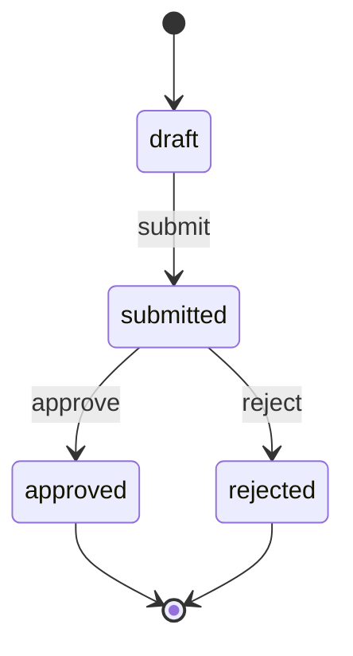

# Refund quickstart

This walkthrough uses a refund policy to show the whole boundary: an agent proposes approval, a
deterministic rule refuses it, and the original state remains unchanged.

## Install the command

Every release includes `entity` binaries for Linux, macOS, and Windows plus `SHA256SUMS`:
[download a release](https://github.com/beyond10x/entity-runtime/releases).

Or install from the tagged source with Rust 1.85 or newer:

```bash
cargo install --git https://github.com/beyond10x/entity-runtime \
  --tag 0.17.7 --locked entity-cli
entity --version
```

The complete definition used here is
[`examples/refund.yaml`](https://github.com/beyond10x/entity-runtime/blob/0.17.7/examples/refund.yaml).
The following Bash setup downloads that exact version into a fresh temporary directory. It needs
`curl`; subsequent commands use that directory so another run cannot collide with its files or store.
The sample actor names and timestamps are demonstration data, not authenticated identities or a
trusted clock.

```bash
set -euo pipefail
refund_demo_dir="$(mktemp -d)"
cd "$refund_demo_dir"
curl --fail --show-error --location --max-time 30 \
  https://raw.githubusercontent.com/beyond10x/entity-runtime/0.17.7/examples/refund.yaml \
  --output refund.yaml
```

## Understand the policy

The definition has four states:

```shell-session
$ entity graph refund.yaml
refund v1: initial draft
draft --submit--> submitted
submitted --approve--> approved
submitted --reject--> rejected
```

The same lifecycle can go straight into Markdown, an issue, or an agent report:

```shell-session
$ entity graph refund.yaml --format mermaid
```



This block is the command's exact output, not a hand-maintained second diagram.

Approval has two preconditions:

```yaml
preconditions:
  - name: evidence_is_present
    assert: { gt: [$fields.evidence_count, 0] }
    message: a refund cannot be approved without evidence
  - name: large_refunds_need_a_human
    assert:
      any:
        - lte: [$fields.amount_cents, 5000]
        - eq: [$args.actor_role, human]
    message: refunds above 5000 cents require a human actor
```

Validate the complete document before using it:

```shell-session
$ entity validate refund.yaml
refund.yaml: valid (refund v1)
1 file(s), 0 invalid
```

## Create and submit a request

The kernel generates no identity, so the caller supplies one:

```bash
entity create --definition refund.yaml --id refund-104 \
    --fields '{"order_id":"order-88","amount_cents":12500,"evidence_count":2}' \
  > draft.json

entity execute --definition refund.yaml --instance @draft.json \
    --operation submit > submitted.json
```

`submitted.json` is a `Decision`: it contains the new instance, its complete replay record, and the
events produced by `submit`.

## Let the agent propose approval

The trusted shell supplies `actor_role: agent` from its execution context. It is not a label the
model is allowed to choose.

```bash
if entity execute --definition refund.yaml --instance @submitted.json \
    --operation approve \
    --arguments '{"actor_role":"agent","reason":"customer supplied delivery evidence"}'; then
  echo "Expected policy refusal, but approval succeeded" >&2
  exit 1
else
  refusal_status=$?
  test "$refusal_status" -eq 1
fi
```

The command prints this structured refusal (plus a readable summary on stderr):

```json
{
  "kind": "precondition_failed",
  "message": "precondition 'large_refunds_need_a_human' failed for operation 'approve': refunds above 5000 cents require a human actor",
  "operation": "approve",
  "reason": "refunds above 5000 cents require a human actor",
  "rule": "large_refunds_need_a_human"
}
```

The operation was understood and refused. `submitted.json` is still submitted at revision 2, and
no `RefundApproved` event exists.

## Authorize and store the decision

For durable use, create and execute against a File Store. Stored commands require provenance the
kernel cannot invent:

```bash
entity create --definition refund.yaml --id refund-104 \
    --fields '{"order_id":"order-88","amount_cents":12500,"evidence_count":2}' \
    --store ./refund-store --record-id request-104-created \
    --recorded-at 2026-08-31T10:00:00Z --actor support-api

entity execute --definition refund.yaml --store ./refund-store \
    --id refund-104 --operation submit \
    --record-id request-104-submitted --recorded-at 2026-08-31T10:01:00Z \
    --actor support-agent

entity execute --definition refund.yaml --store ./refund-store \
    --id refund-104 --operation approve \
    --arguments '{"actor_role":"human","reason":"supervisor verified the delivery evidence"}' \
    --record-id request-104-approved --recorded-at 2026-08-31T10:04:00Z \
    --actor supervisor-7 --format text
```

The final command prints:

```text
refund refund-104 is approved (revision 3); record request-104-approved; events: RefundApproved
```

The generic CLI loads revision 2 and uses it as the commit expectation before writing revision 3. A concurrent writer is refused instead
of overwritten. The resulting record includes the caller-supplied actor and time, normalized
command, exact definition snapshot, new instance, changes, and events.

For a service that must preserve a previously observed revision and safely retry an accepted
request, use the [generated CLI](./generated-cli), [MCP tools](./mcp), or `StoredRuntime`.
Generic `entity execute --store` reloads current state on every call; it is not that retry boundary.
Your demo files remain under `$refund_demo_dir` for inspection.

## Next

- [Model policy as data](./modeling)
- [Connect an agent safely](./agent-integration)
- [Understand stored decisions](./storage)
- [Read the complete CLI reference](./cli)
- [Render lifecycle and reference graphs](./graphs)
