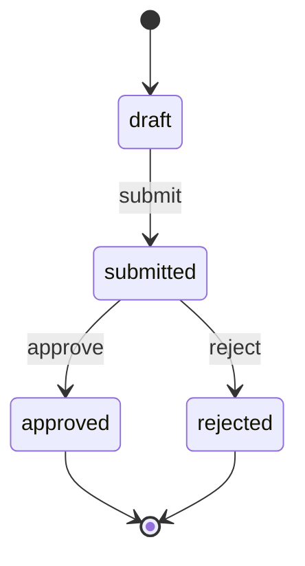
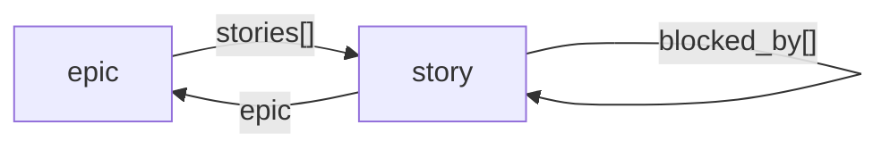

# Render lifecycle and reference graphs

Graphs are another view of the definition, not another model to maintain. The renderer reads the
validated states, operations, and typed references that execution reads.

## Lifecycle diagrams

```bash
entity graph refund.yaml --format text
entity graph refund.yaml --format mermaid
entity graph refund.yaml --format dot
entity graph refund.yaml --format svg > refund.svg
entity graph refund.yaml --format html > refund.html
```

Mermaid uses a state diagram for lifecycles:



Opaque identifiers such as `n0` are intentional. A state name remains a label and cannot become a
Mermaid directive. Initial and terminal markers come from the lifecycle itself.

## Typed-reference diagrams

Pass the complete related definition set and `--references`:

```bash
entity graph examples/references/*.yaml --references --format mermaid
```

Reference graphs use a flowchart because their nodes are entity types, not lifecycle states:



The real output includes nested and operation-argument references. A target missing from the set is
still drawn with a dashed style, while validation refuses the incomplete registry.

## Choose a format

| Format | Best for |
|---|---|
| `text` | terminals, logs, and compact agent context |
| `mermaid` | Markdown, reviews, issues, and documentation systems |
| `dot` | Graphviz-based pipelines and custom layouts |
| `svg` | deterministic, dependency-free images |
| `html` | one portable page with an accessible edge table |

Every renderer is deterministic and escapes names for its own syntax.
