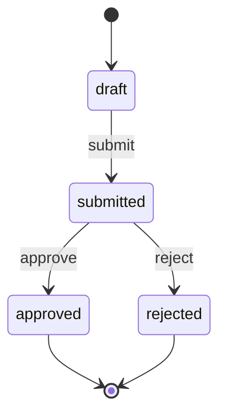

# Render lifecycle and reference graphs

The renderer reads the validated states, operations and typed references that execution reads, so
the drawing cannot disagree with the policy. Every format is deterministic: the same definitions
give the same bytes.

This guide uses [`examples/refund.yaml`](https://github.com/beyond10x/entity-runtime/blob/0.27.0/examples/refund.yaml)
from [getting started](../getting-started.md) and the two definitions in
[`examples/references/`](https://github.com/beyond10x/entity-runtime/tree/0.27.0/examples/references).

## Draw a lifecycle

```shell-session
$ entity graph refund.yaml
refund v1: initial draft
draft --submit--> submitted
submitted --approve--> approved
submitted --reject--> rejected
$ entity graph refund.yaml --format mermaid
stateDiagram-v2
  state "draft" as n0
  state "submitted" as n1
  state "approved" as n2
  state "rejected" as n3
  [*] --> n0
  n0 --> n1: submit
  n1 --> n2: approve
  n1 --> n3: reject
  n2 --> [*]
  n3 --> [*]
```

Rendered, that Mermaid output is:



The opaque ids (`n0`) are deliberate: a state name stays a label and cannot become a Mermaid
directive. The initial and terminal markers come from the lifecycle itself.

```shell-session
$ entity graph refund.yaml --format dot
digraph "refund v1" {
  rankdir=LR;
  node [shape=box];
  "draft" [label="draft" peripheries=2];
  "submitted" [label="submitted"];
  "approved" [label="approved" style=filled fillcolor="#eeeeee"];
  "rejected" [label="rejected" style=filled fillcolor="#eeeeee"];
  "draft" -> "submitted" [label="submit"];
  "submitted" -> "approved" [label="approve"];
  "submitted" -> "rejected" [label="reject"];
}
```

`--format svg` writes a standalone image laid out by `entity-graph` itself, and `--format html` one
self-contained page with the drawing and the same edges as a table:

```bash
entity graph refund.yaml --format svg > refund.svg
entity graph refund.yaml --format html > refund.html
```

A lifecycle belongs to one definition. Passing several without `--references` is an invalid
invocation (exit 2):

```shell-session
$ entity graph refund.yaml references/story.yaml
error: a lifecycle is one definition's; pass one file, or --references to draw the edges between several
```

## Draw typed references

Pass the complete related set and `--references`. Nodes are entity types and edges are `ref`
fields, including references inside operation arguments:

```shell-session
$ entity graph references/*.yaml --references
references
epic --adopt: story--> story
epic --stories[]--> story
story --blocked_by[]--> story
story --epic--> epic
$ entity graph references/*.yaml --references --format mermaid
flowchart LR
  n0["epic"]
  n1["story"]
  n0 -->|adopt&#58; story| n1
  n0 -->|stories#91;#93;| n1
  n1 -->|blocked_by#91;#93;| n1
  n1 -->|epic| n0
```

A target missing from the set is still drawn, dashed, while validation refuses the incomplete set:

```shell-session
$ entity graph references/story.yaml --references --format mermaid
flowchart LR
  n0["epic"]
  n1["story"]
  n1 -->|blocked_by#91;#93;| n1
  n1 -->|epic| n0
  classDef missing stroke-dasharray: 4 3
  class n0 missing
$ entity validate references/story.yaml
references/story.yaml: valid (story v1)
across the set: story's 'schema.epic' points at entity 'epic', which is not registered
1 file(s), 0 invalid
```

That `validate` exits 1: each file is valid alone, the set is not.

## Choose a format

| `--format` | Best for |
|---|---|
| `text` (default) | terminals, logs and compact agent context |
| `mermaid` | Markdown, reviews, issues and documentation sites |
| `dot` | Graphviz pipelines and custom layouts |
| `svg` | a dependency-free image |
| `html` | one portable page with an accessible edge table |
