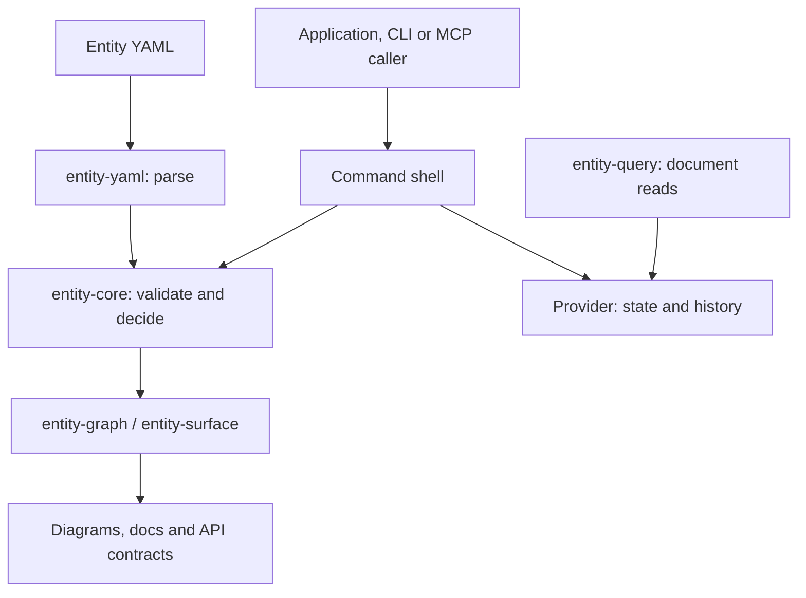
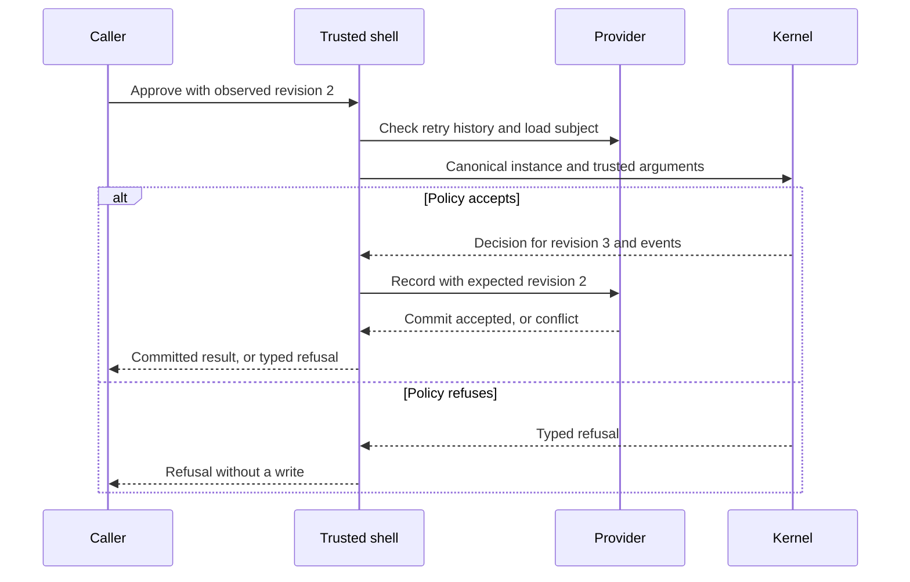
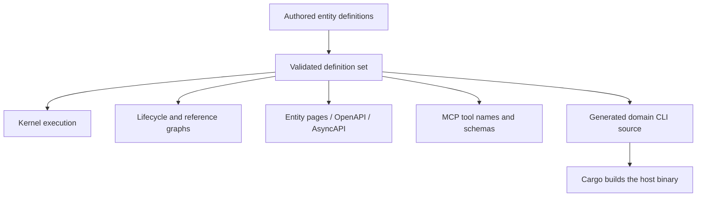

# System model and derivation

Entity Runtime is a collection of Rust libraries and command surfaces around one deterministic
kernel. It can execute an adopter's entity model and derive interfaces from it. The runtime itself
is implemented as authored Rust types, traits, and functions; this repository has no whole-system
ESS specification from which those subsystems are generated.

This chapter describes the [0.17.7 release](https://github.com/beyond10x/entity-runtime/releases/tag/0.17.7).
The public API remains in development. An entity's `version: 1` is its definition version,
independent of the runtime release and File Store format.

## Subsystems and boundaries

Arrows below show inputs and calls. Storage IO stays in the selected provider; authentication,
trusted time, and external effects belong to the application.

| Subsystem | Model or contract | What it owns |
|---|---|---|
| Definition input | `EntityDefinition`, `Registry`, `ValidatedDefinition` | Schemas, lifecycles, rules, operation arguments, templates, references, and projections |
| Decision kernel | `Runtime`, `DecisionCommand`, `Decision`, `CoreError` | Creation and named operations; deterministic result or typed refusal |
| Recording | `DecisionRecord`, `Recording`, `Envelope`, `RecordedCommit` | Replay evidence and caller-supplied provenance |
| Persistence | `Store`, `HistoryProvider`, `AtomicBatchStore` | Expected revisions, accepted state plus history, and explicitly supported batches |
| Reads and views | `DocumentQueryProvider`, projection definitions | Optional filtered document pages and deterministic groupings |
| Remote and hybrid | `Transport`, remote protocol, hybrid policy | Caller-selected transport, authority, offline behavior, and recorded divergences |
| Command surfaces | `entity-cli`, `StoredRuntime`, `entity-mcp` | Input decoding, provider calls, results, and tool schemas |
| Projections | `entity-graph`, `entity-surface`, CLI generator | Diagrams, documentation, API contracts, and definition-specific commands |

The [library guide](./guide/library) maps these responsibilities to crates.
`entity-xtask` and `scan-support` support repository checks; they are not application services.
No provider, command surface, or generated API introduces a hosted service automatically.

## What is modeled, and what remains a host responsibility?

| Concern | Declared or checked here | Boundary |
|---|---|---|
| Entity state | Field schemas, identity, definition version, lifecycle state, revision | The host loads canonical instances; public Rust fields are not an access-control boundary |
| Commands | Creation and named operations, typed arguments, transitions, preconditions, assignments | Authentication and delegation are not operation-argument validation |
| Domain events | Optional creation event and ordered operation event templates | No broker, subscriptions, delivery acknowledgment, or automatic effect execution |
| Rules | Preconditions and invariants, with true/false/unknown results | Evidence enters as data; the kernel cannot verify an external fact by looking it up |
| References | Target entity types, inverse labels, and acyclic declarations | The host checks referenced instances and graph-wide constraints |
| History | Decision records, recording envelopes, observations, legacy boundaries | Provenance records what the caller supplied; it does not authenticate it |
| Persistence and concurrency | Provider traits, revision checks, record conflicts, provider-specific transactions | Atomicity is bounded by the provider; File Store commits one subject at a time |
| Queries and projections | Containment queries, continuation cursors, grouping projections | No general search service, SQL interface, or background projection worker |
| Whole-system architecture | Authored crate boundaries and this coverage map | No ESS `system.yaml`, exhaustive system-domain catalog, or generated implementation of the runtime |

“The entity is modeled” therefore means its declared fields, operations, rules, and events are
checked. It does not mean every surrounding service or business domain has a definition. Adopters
must decide which parts of their system cross this boundary and model those explicitly.

## Commands, decisions, events, and observations

These are different values with different purposes:

| Value | Meaning | Does it change the subject revision? |
|---|---|---|
| Command | Request to create an entity or execute a named operation | Only if accepted and committed |
| `Decision` | Complete accepted result, replay record, and domain events | Proposes revision 1 or the next revision; the kernel persists nothing |
| `DomainEvent` | A materialized event template from an accepted decision | Shares the decision's revision; one decision can have several events or none |
| `RecordedCommit` | Decision sealed with record identity, time, and actor information | Persists the accepted revision when the provider commits it |
| `RecordedObservation` | Provenance-bearing evidence about a subject | No lifecycle revision change |
| Typed refusal | A request could not be accepted | No accepted decision or domain events |

A decision record retains the normalized command and definition snapshot even when the operation
emits no event. Reading `events` is therefore not a complete audit-history read. Use
`HistoryProvider` for recorded decisions and observations; use complete decision replay to
verify execution. [Legacy event folding](./guide/storage#replay-and-legacy-history) proves less.

For example, the refund quickstart creates `refund-104` at revision 1, submits it at revision 2,
and approves it at revision 3 with `RefundApproved`. Approval records a policy decision. A payment
provider has not refunded money merely because that event exists.

This is the stored operation path used by generated CLIs and MCP. An exact recorded retry returns
the original accepted result before a new decision is made. External publication happens only
after a successful commit and needs the host's own delivery and deduplication policy.
See [retry boundaries](./guide/storage#retry-boundaries) for the generic CLI's different behavior.

## What is actually derived?

| Surface | Derived part | Authored part |
|---|---|---|
| `entity` executable | Clap derives argument parsing; `entity skill` renders version-stamped guidance | Top-level verbs, handlers, and skill prose in the runtime source |
| Generated domain CLI | Entity names, operation subcommands, embedded definitions | Generator templates and shared stored execution; Cargo compiles the result |
| MCP server | Tool names and input schemas from the mounted definitions | Protocol handling and dispatch through `StoredRuntime` |
| OpenAPI and AsyncAPI | Entity request shapes and inferred emitted-event payload schemas | Projection rules; an adopter must implement HTTP and event transport |
| Entity reference and graphs | Fields, transitions, rules, events, references, and diagrams | Renderer and presentation templates |

The generated surfaces shipped in 0.16.0. The 0.17.7 release fixes their retry and schema behavior.
Neither release converted the top-level CLI into an ESS-generated implementation. The
[CLI source](https://github.com/beyond10x/entity-runtime/blob/0.17.7/crates/entity-cli/src/main.rs)
contains both its handwritten command enum and its domain-CLI generator;
the [shared shell](https://github.com/beyond10x/entity-runtime/blob/0.17.7/crates/entity-shell/src/lib.rs)
owns the generated/MCP stored-operation sequence.

## Relationship to ESS

[ESS](https://beyond10x.github.io/docs/ess/) specifies systems using its own `ess/1` format,
including domains, entities, commands, events, and components. Entity Runtime accepts its own
entity-definition format headed by `entity:` and `version:`. Similar concepts do not make
those files interchangeable.

This runtime does not depend on ESS or ship an ESS importer/compiler. Its JSON Schema and API
projections describe supported entity surfaces; they are not a generated schema for an ESS system
or proof of complete coverage of the runtime's own architecture.

Start with the [refund quickstart](./guide/getting-started), then use the
[definition language](./guide/definitions) and [guarantees](./guarantees) to decide what to model.
